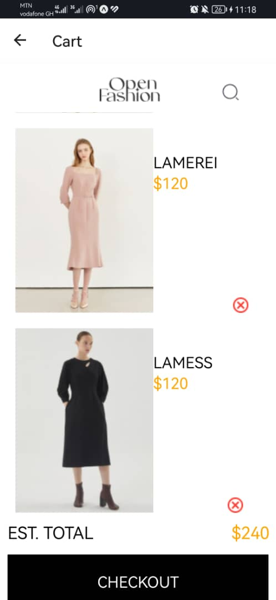

# rn-assignment6-11079266

# rn-assignment5-11079266

---

# Mobile App with Cart Functionality

## Components

- **App**: Main component rendering the stack navigator.
- **HomeScreen**: Displays a list of products and allows adding products to the cart.
- **CartScreen**: Displays the items added to the cart with the option to remove them.

## Purpose

This mobile app demonstrates a basic shopping cart functionality using React Native and React Navigation. Users can add products to the cart and view them in a separate cart screen.

## Usage

1. **Installation**:
   - Clone the repository and navigate to the project folder.
   - Run `npm install` to install dependencies.

2. **Run the App**:
   - Start Metro Bundler with `npm start`.
   - Launch the app on a simulator or device using Expo Go or Xcode/Android Studio.
   - Alternatively, scan the QR code from Metro Bundler using the Expo Go app.

## Screenshots

---

